## **River Images Classification of Sao Carlos using DL**

### 🎯 **Goal**

The goal of this project is to classify river water level images from the 
Sao Carlos dataset into four categories — **low, medium, high, and flood** — 
using multiple deep learning models and identify the best performing approach 
for real-world flood monitoring applications.

### 🧵 **Dataset**

[River Images at Sao Carlos — Kaggle](https://www.kaggle.com/datasets/caetanoranieri/river-images-at-sao-carlos)

- Total images: 68,599
- Labels: `low`, `medium`, `high`, `flood` (from `flood_images_annot_2.csv`)
- Camera locations: SHOP, SHOP2
- Years covered: 2018–2022

### 🧾 **Description**

This project uses a time-series river image dataset captured at two camera 
locations in Sao Carlos, Brazil. The dataset is severely imbalanced — 98.8% 
of images are labeled as `low` water level. A balanced sampling strategy was 
applied (all minority class images + 500 low samples), and six deep learning 
models were trained and compared using accuracy, precision, recall, F1-score 
and confusion matrices.

### 🧮 **What I had done!**

1. Loaded and explored the dataset using the annotation CSV file
2. Built full image paths by combining the CSV `path` column with the base directory
3. Performed Exploratory Data Analysis — class distribution, sample images per class, camera-wise distribution, temporal distribution, and image size analysis
4. Identified severe class imbalance (98.8% low class) and applied balanced sampling
5. Built a `tf.data` pipeline with caching, prefetching, and data augmentation
6. Computed class weights to handle remaining imbalance during training
7. Implemented 6 deep learning models — 1 custom CNN and 5 transfer learning models
8. Trained all models with EarlyStopping, ReduceLROnPlateau, and ModelCheckpoint callbacks
9. Evaluated each model using validation accuracy, loss, precision, recall, F1-score
10. Generated confusion matrices and training curves for all models
11. Compared all models and identified the best performer

### 🚀 **Models Implemented**

- **Custom CNN** — Built from scratch as a baseline model with 4 convolutional blocks, batch normalization and dropout. Chosen to establish a lower-bound performance without pretrained weights.
- **VGG16** — Transfer learning with ImageNet weights. Chosen for its proven performance on image classification tasks with straightforward architecture.
- **ResNet50** — Transfer learning with residual connections. Chosen to test if skip connections help with the small balanced dataset.
- **MobileNetV2** — Lightweight transfer learning model. Chosen for its accuracy-efficiency balance, suitable for deployment in real-time monitoring systems.
- **EfficientNetB0** — Transfer learning with compound scaling. Chosen to test performance with fewer parameters.
- **DenseNet121** — Transfer learning with dense feature reuse across layers. Chosen because feature reuse is particularly effective on smaller datasets.

### 📚 **Libraries Needed**

- TensorFlow
- Keras
- NumPy
- Pandas
- Matplotlib
- Seaborn
- scikit-learn
- Pillow (PIL)

### 📊 **Exploratory Data Analysis Results**

**Class Distribution**

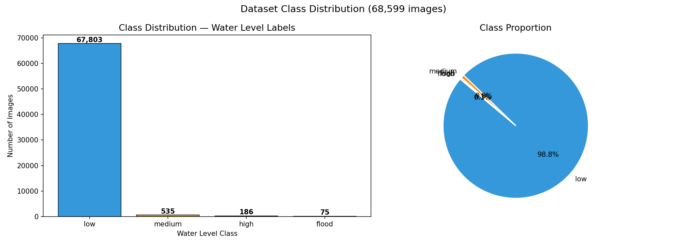

**Sample Images per Water Level Class**

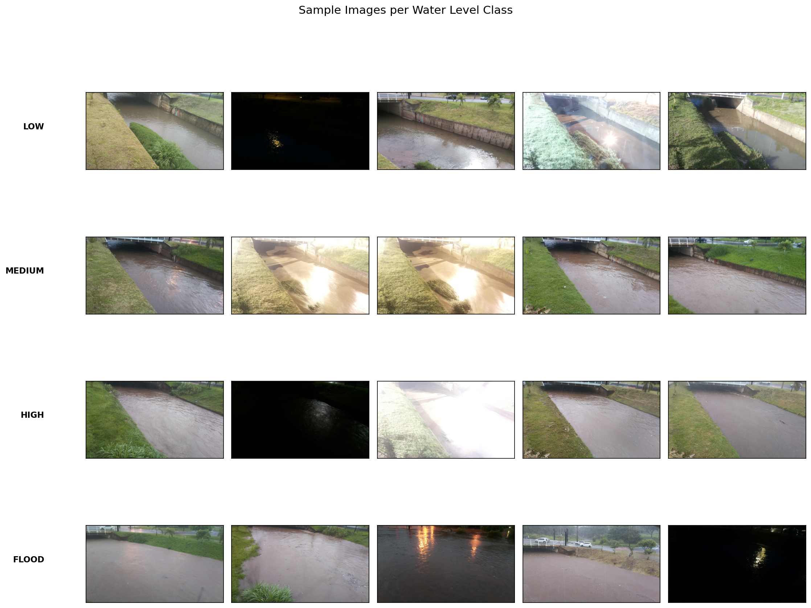

**Class Distribution by Camera Location**

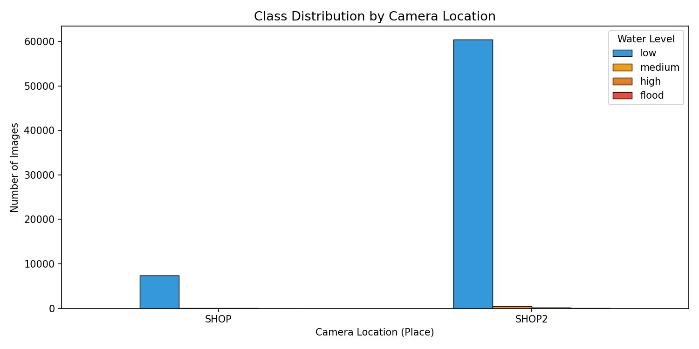

**Temporal Distribution of Images**

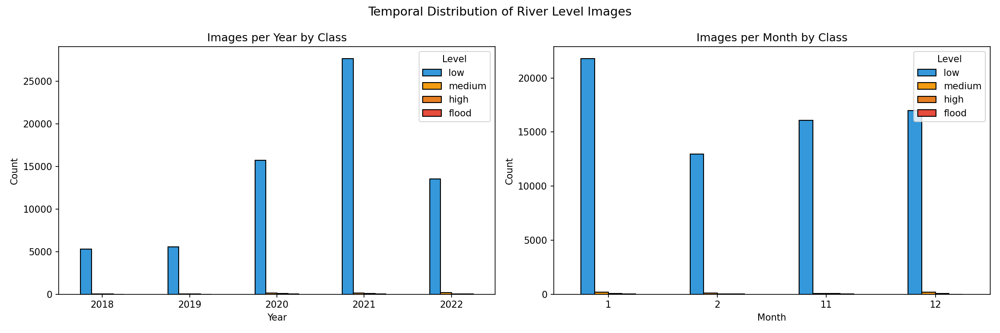

**Image Size Distribution**

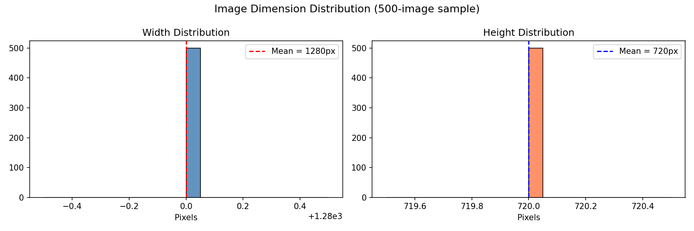

### 📈 **Performance of the Models based on the Accuracy Scores**

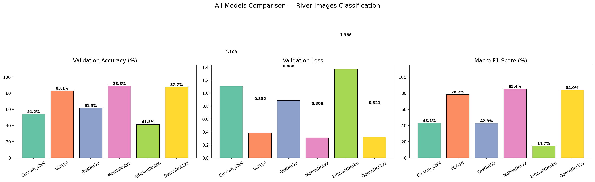

| Model | Val Accuracy | Val Loss | Precision | Recall | F1-Score |
|-------|:-----------:|:--------:|:---------:|:------:|:--------:|
| **DenseNet121** | **89.23%** | **0.3121** | **84.55%** | **87.59%** | **85.95%** |
| MobileNetV2 | 86.92% | 0.4043 | 81.45% | 82.93% | 82.08% |
| VGG16 | 86.54% | 0.3878 | 81.03% | 83.63% | 81.90% |
| ResNet50 | 64.23% | 1.1094 | 34.83% | 39.90% | 35.97% |
| Custom CNN | 55.38% | 1.3255 | 48.96% | 52.99% | 46.94% |
| EfficientNetB0 | 41.54% | 1.2854 | 10.38% | 25.00% | 14.67% |

**Training Curves**

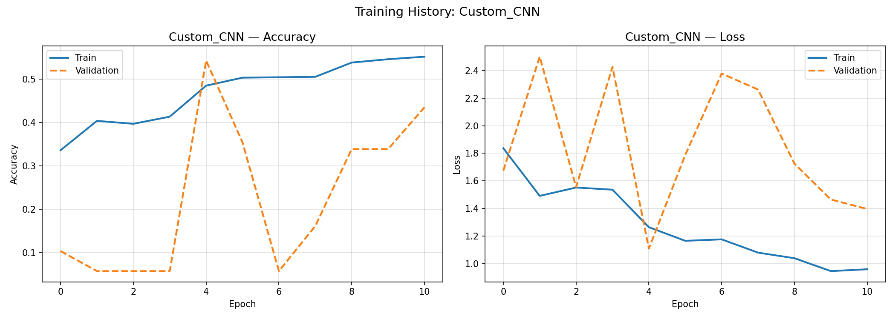
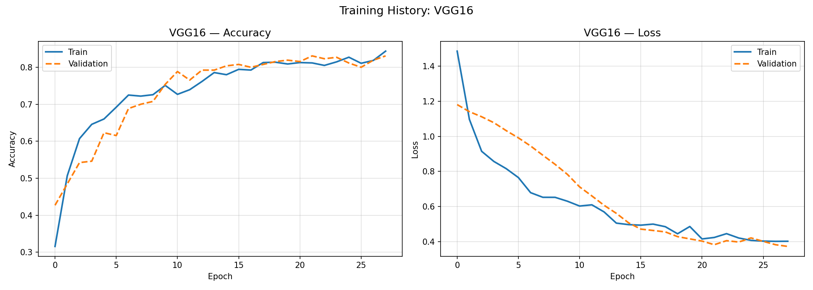
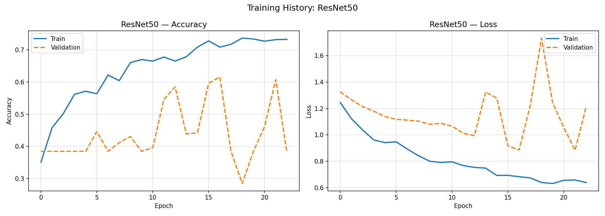
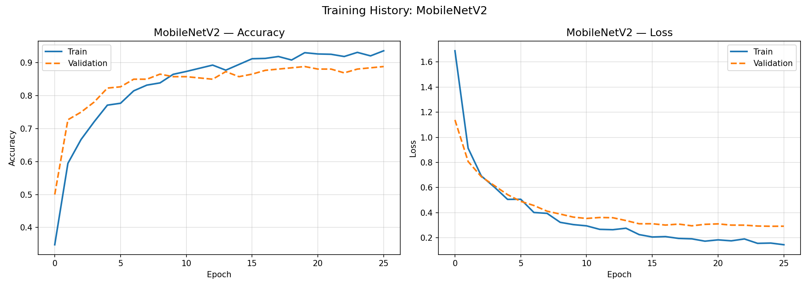
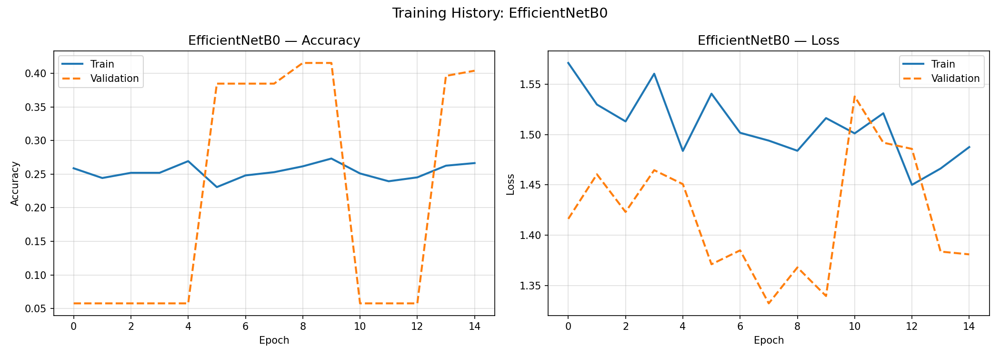
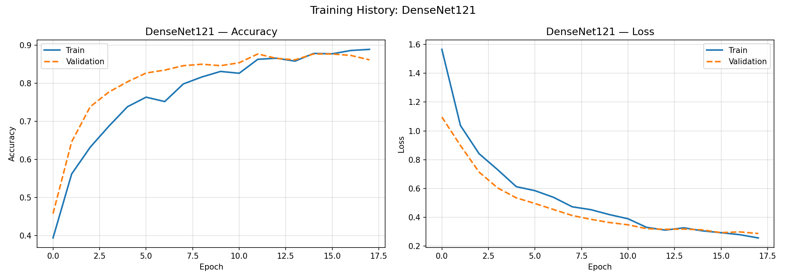

**Confusion Matrices**

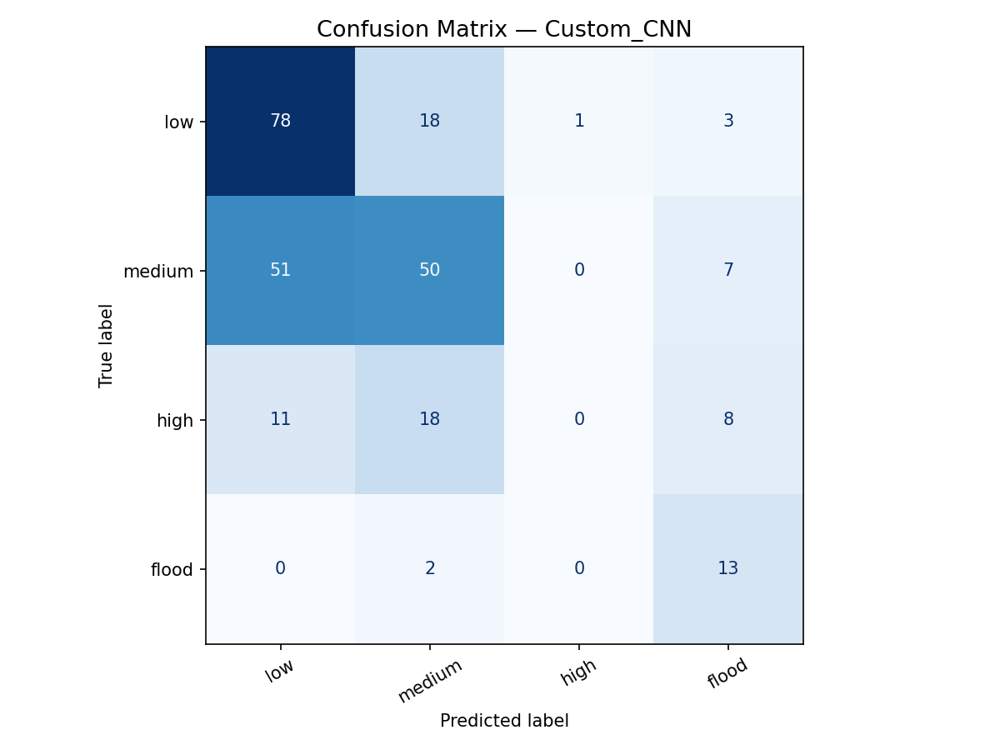
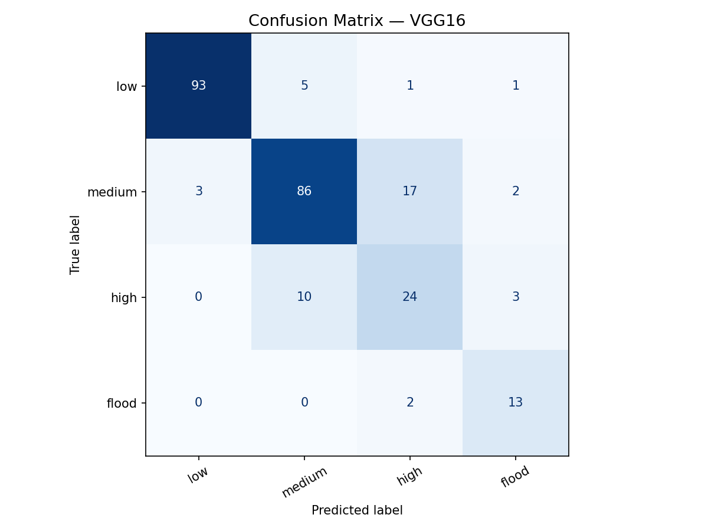
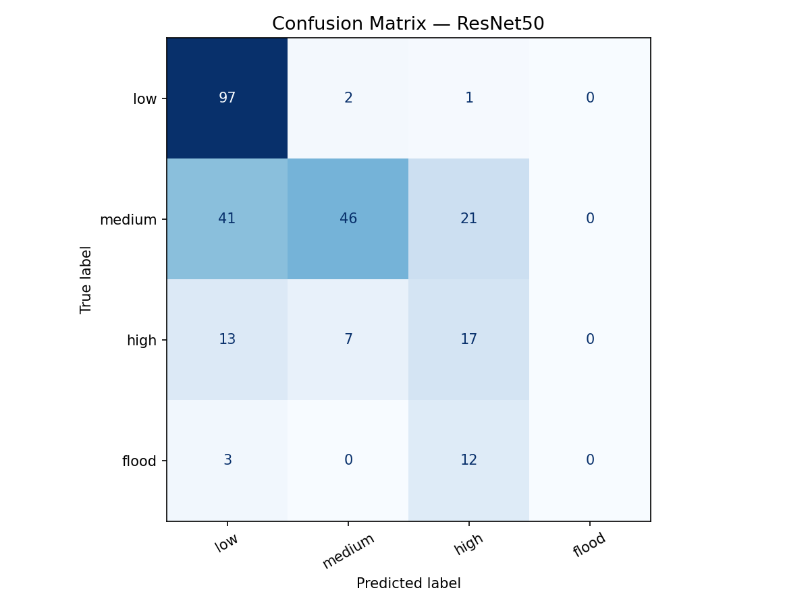
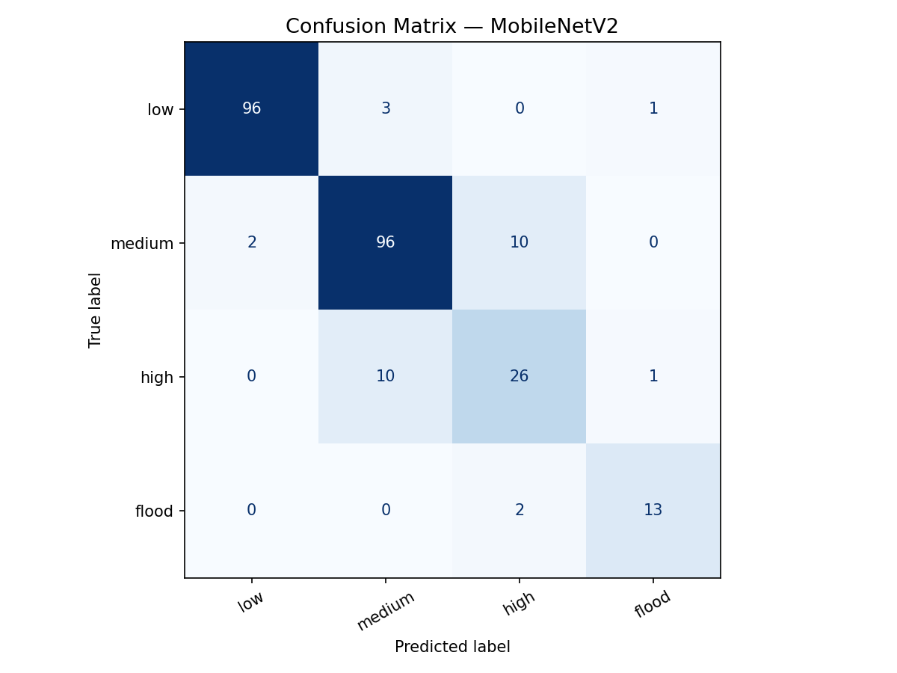
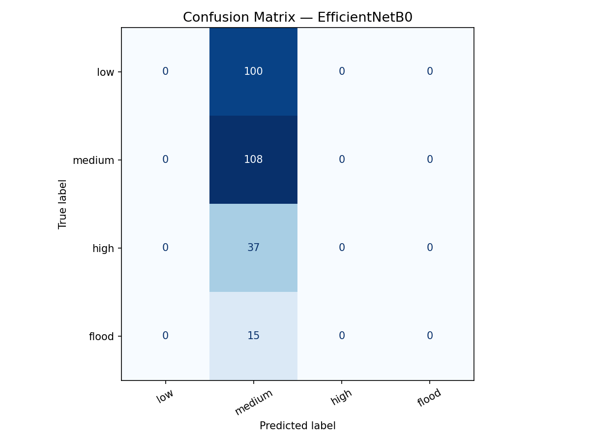
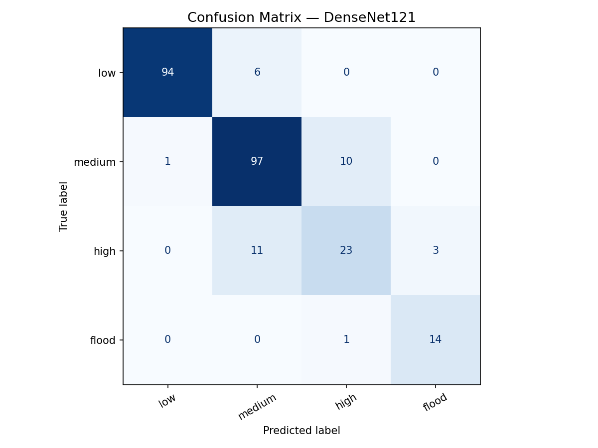

### 📢 **Conclusion**

Among all six models, **DenseNet121 achieved the best validation accuracy 
of 89.23% with an F1-Score of 85.95%** on the balanced river image dataset.

- **Custom CNN (55.38%)** — Struggled without pretrained weights on the 
  small balanced dataset, confirming the value of transfer learning.
- **EfficientNetB0 (41.54%)** — Underperformed due to preprocessing 
  mismatch with the standard normalization pipeline used.
- **ResNet50 (64.23%)** — Underperformed, likely needing more data for 
  its deeper architecture to generalize well on this small dataset.
- **VGG16 (86.54%)** — Strong performer but the heaviest model here, 
  less suited for real-time deployment.
- **MobileNetV2 (86.92%)** — Excellent accuracy-efficiency balance, 
  suitable for real-time river monitoring deployment.
- **DenseNet121 (89.23%)** — Best overall model. Dense feature reuse 
  across layers proved highly effective on this small balanced dataset, 
  achieving the highest accuracy and F1-score among all models.

**DenseNet121 is recommended** for river water level classification tasks, 
while **MobileNetV2 is recommended** if deployment efficiency is a priority.

### ✒️ **Your Signature**

**Payal Sumbhe**  
GitHub: [@payalrvs3](https://github.com/payalrvs3)  
Email: payalrvs0310@gmail.com